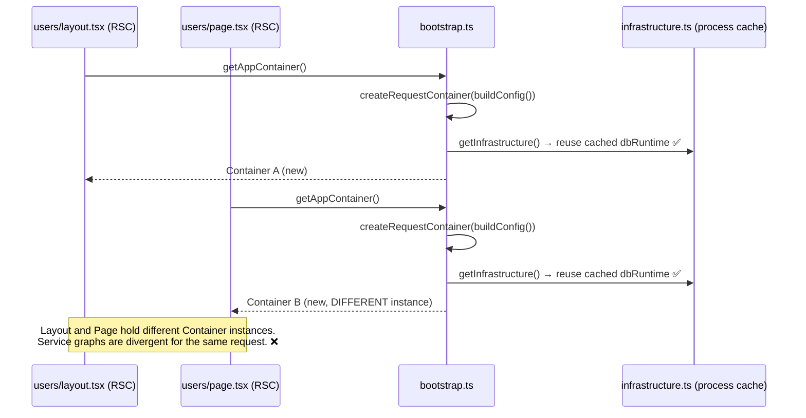
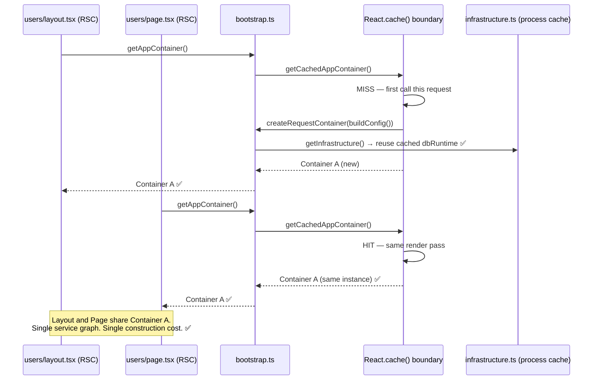
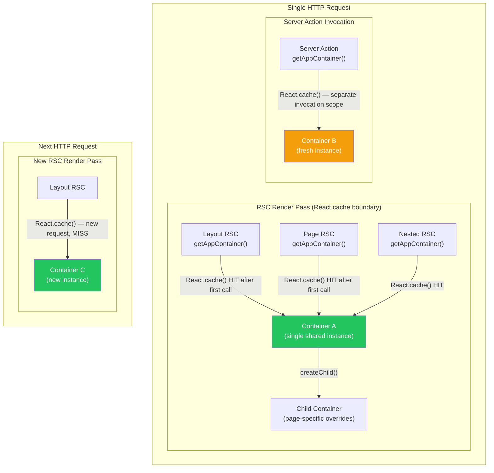
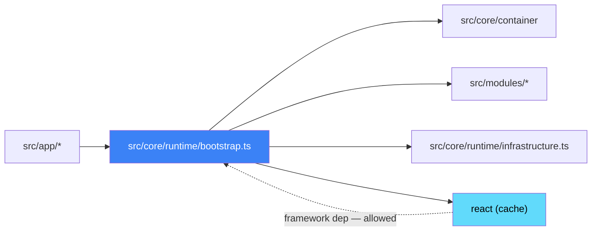
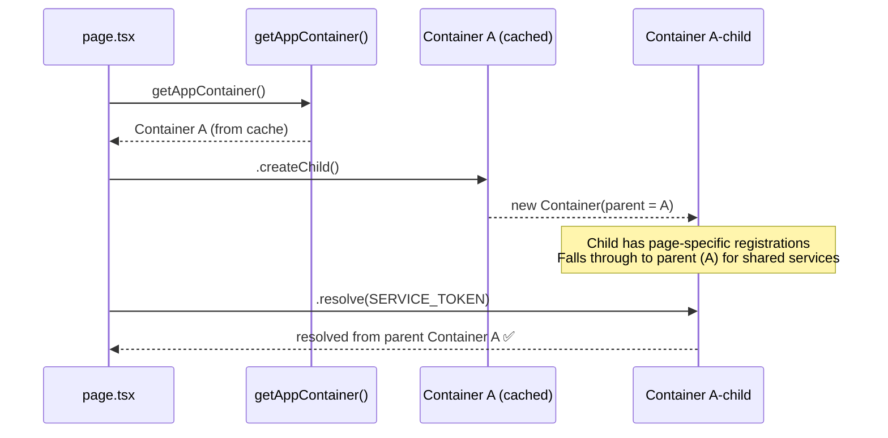

# Architecture Review: Per-Request DI Container Caching

**Task ID**: `2026-04-05-per-request-caching`
**Agent**: 01 — Architecture Guard
**Status**: ✅ Complete
**Date**: 2026-04-05

---

## Task

Introduce request-scoped memoization of the application DI Container using `React.cache()` so all Server Components in one RSC render pass share the same Container instance and service graph.

---

## Architecture Fit

**Outcome: Safe**

The proposed change is a targeted internal improvement to the composition root (`src/core/runtime/bootstrap.ts`). It does not alter any contracts, service interfaces, module boundaries, or provider implementations. The public `getAppContainer()` API is preserved. The internal container factory gains a request-scope memoization layer using React 19's `cache()` API, which is designed exactly for this purpose in App Router architectures.

---

## Problem: Current Architecture (Verified)

Every call to `getAppContainer()` constructs a brand-new Container:



**Work duplicated per call** (code-verified):

- `new Container()` construction
- `new DrizzleMembershipRepository(dbRuntime.db)` instantiation
- `createFeatureFlagService(...)` — GrowthBook SDK module-level wiring
- `new DrizzleProvisioningService(...)` instantiation
- `createAuthModule(...)` + `createAuthorizationModule(...)` registration

**Note**: `getInfrastructure()` already has a process-level cache via `globalThis.__NEXTJS16_BOILERPLATE_PROCESS_INFRASTRUCTURE__` — the `dbRuntime` is correctly shared. The missing layer is the **request-scope Container cache** above it.

---

## Target Architecture



---

## Caching Scope Behaviour



**Key behavioural properties of `React.cache()`** (React 19 docs):

- Cache is scoped to a single React server render pass
- Cache is **automatically invalidated** between server requests — no manual cleanup needed
- Works only in Server Component context (correct for this use case)
- Within a single Server Action invocation, provides per-action deduplication
- Does **not** persist across separate HTTP requests, separate Server Action calls, or across client/server boundary

---

## Proposed Implementation Shape

### Layer 1 — Wrapper in `src/core/runtime/bootstrap.ts`

```typescript
// src/core/runtime/bootstrap.ts
import { cache } from 'react';

// Internal: request-scoped memoized factory. React.cache() guarantees:
// - same Container returned for all RSC calls within one render pass
// - automatic invalidation between server requests
// - per-invocation deduplication within Server Actions
const getRequestScopedContainer = cache(
  (): Container => createRequestContainer(buildConfig()),
);

// Public API: unchanged signature, wrapper pattern
export function getAppContainer(): Container {
  return getRequestScopedContainer();
}
```

**Why this works**: `React.cache()` requires that all callers invoke the **same memoized function reference**. Because `getRequestScopedContainer` is a module-level constant, all callers of `getAppContainer()` reach the same `cache()` boundary and receive the memoized result within one render pass.

### Layer 2 — Optional: Targeted Read-Model Memoization

For expensive server-side reads (identity, tenant, feature flags, provisioning status), a second layer of targeted memoization can be introduced as explicit opt-in helpers. These are **not part of the initial change** but are included in the design for future adoption.

```typescript
// src/core/runtime/request-memoize.ts  (optional — Layer 2)
import { cache } from 'react';
import { AUTH } from '@/core/contracts';
import type { IdentityProvider } from '@/core/contracts/identity';
import { getAppContainer } from './bootstrap';

// Identity resolution: one DB/Clerk call per render pass regardless of how
// many RSCs need the current user.
export const getCurrentIdentity = cache(async () => {
  const container = getAppContainer();
  const identityProvider = container.resolve<IdentityProvider>(
    AUTH.IDENTITY_PROVIDER,
  );
  return identityProvider.getCurrentIdentity();
});

// Additional helpers can follow the same pattern:
// export const getCurrentTenant = cache(async () => { ... });
// export const resolveProvisioningStatus = cache(async () => { ... });
// export const evaluateFeatureFlag = cache(async (flagKey: string, ctx: AuthorizationContext) => { ... });
```

**Design note on Layer 2**: The `cache()` wrapper for parameterised functions (like `evaluateFeatureFlag(flagKey, ctx)`) works correctly — React memoizes by argument reference equality. This is suitable for string flag keys + stable context objects.

---

## Architecture Layers Affected

| Layer          | File                                                  | Change                                                            |
| -------------- | ----------------------------------------------------- | ----------------------------------------------------------------- |
| `core/runtime` | `src/core/runtime/bootstrap.ts`                       | Wrap internal factory with `React.cache()`. Public API unchanged. |
| `core/runtime` | `src/core/runtime/request-memoize.ts` (new, optional) | Targeted read-model cache helpers for Layer 2                     |
| `app`          | All pages/layouts calling `getAppContainer()`         | No code changes — transparent via wrapper                         |
| `app`          | All server actions calling `getAppContainer()`        | No code changes — per-invocation behaviour preserved              |

---

## Modules Affected

| Module                          | Impact                                                |
| ------------------------------- | ----------------------------------------------------- |
| `src/core/runtime/bootstrap.ts` | Primary change point                                  |
| `src/modules/auth/*`            | Services consumed via resolved container — unaffected |
| `src/modules/authorization/*`   | Same                                                  |
| `src/modules/feature-flags/*`   | Same                                                  |
| `src/modules/provisioning/*`    | Same                                                  |
| `src/core/container/*`          | `Container` class unchanged                           |

---

## Boundary Impact

| Concern              | Assessment                                                                                                                       |
| -------------------- | -------------------------------------------------------------------------------------------------------------------------------- |
| Module boundaries    | ✅ Not affected — change is internal to `core/runtime`                                                                           |
| Dependency direction | ✅ Compliant — `bootstrap.ts` depends on `React` (framework), not upper layers                                                   |
| Composition root     | ⚠️ Modified — the composition root gets a memoization layer; this is the correct location for request-scope lifecycle management |
| DI container         | ✅ `Container` class unchanged; only its construction is memoized                                                                |
| Public contracts     | ✅ `getAppContainer(): Container` signature unchanged                                                                            |

---

## Dependency Direction Check



All dependency directions preserved. `react` is a framework dependency used throughout `src/app/*` and `src/core/*` — adding `cache` import to `bootstrap.ts` does not introduce a new direction violation.

---

## Provider Isolation Check

✅ No provider SDK leaks. The `React.cache()` wrapper sits above all provider integrations (Clerk, GrowthBook, Drizzle). Providers remain registered inside the container and continue to be accessed through contracts.

---

## Child Container Compatibility

The existing `.createChild()` pattern used in pages is fully compatible:



---

## Connection() Call Requirement

The AGENTS.md documents that any RSC calling `getAppContainer()` **must** call `await connection()` first (from `next/server`) to opt into dynamic rendering and avoid Next.js 16 prerender errors caused by `Date.now()` inside `pino`.

**This requirement is unchanged by the caching change.** The `connection()` call ensures the RSC opts into dynamic rendering. The `React.cache()` memoization operates within the dynamic render scope, not before it. Existing call sites already have this pattern (e.g., `feature-flags-demo/page.tsx:32`).

The `security-showcase/page.tsx` uses `await headers()` for the same purpose. Both approaches remain valid.

---

## Structural Risk Assessment

| Risk                                                       | Likelihood | Impact | Mitigation                                                                                                                                  |
| ---------------------------------------------------------- | ---------- | ------ | ------------------------------------------------------------------------------------------------------------------------------------------- |
| `React.cache()` not available in runtime                   | Low        | High   | React 19 confirmed in `package.json`; `cache` is a stable export                                                                            |
| Server Action receiving stale cached state                 | None       | —      | React.cache() per-invocation scope prevents cross-invocation contamination                                                                  |
| Test isolation broken — shared container across test cases | Medium     | Medium | Each Vitest test module gets fresh imports; `React.cache()` in test env returns a fresh cache; explicit `vi.mock` pattern remains available |
| Edge runtime receives cached Node container                | None       | —      | Edge path uses `createEdgeRequestContainer` — entirely separate code path, unchanged                                                        |
| Circular dependency: `bootstrap.ts` → `react`              | None       | —      | `react` is already used across `src/app/*` and `src/core/*`                                                                                 |

---

## Architectural Decision Record

**Decision**: Use `React.cache()` at the composition root level (`bootstrap.ts`) to memoize the Container factory for RSC render passes.

**Alternatives considered**:

1. **`AsyncLocalStorage`-based store**: Provides cross-context propagation (RSC + Server Actions + route handlers in one request). Rejected as over-engineering — no concrete cross-context requirement exists, and ALS adds operational complexity and testability cost.
2. **Global `Map<requestId, Container>` with manual TTL**: Requires request ID propagation and manual eviction. Error-prone and adds leak risk. Rejected — React's native `cache()` provides request-scoped lifecycle for free.
3. **Cache Container per `buildConfig()` hash**: Wrong scope — would persist across requests if config is stable. Incorrect for request-scoped semantics.
4. **Additive new `getRequestContainer()` function**: Would leave `getAppContainer()` broken and create parallel APIs. Rejected in favour of transparent wrapper.

**Chosen approach**: Transparent wrapper using `React.cache()` — lowest blast radius, React-idiomatic, no call-site changes, correct lifecycle semantics.

---

## Summary

| Item                 | Assessment                                  |
| -------------------- | ------------------------------------------- |
| Architectural fit    | ✅ Safe                                     |
| Boundary violations  | None                                        |
| Contract changes     | None                                        |
| Provider leakage     | None                                        |
| Dependency direction | ✅ Compliant                                |
| Call-site migration  | Not required                                |
| Edge runtime impact  | None                                        |
| Test isolation risk  | Low — addressable in unit tests             |
| Recommended approach | `React.cache()` wrapper at composition root |
