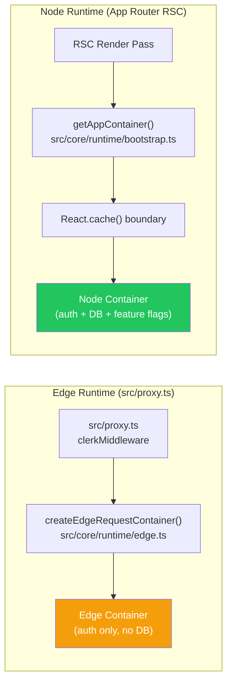

# Runtime Review: Per-Request DI Container Caching

**Task ID**: `2026-04-05-per-request-caching`
**Agent**: 03 — Next.js Runtime
**Status**: ✅ Complete
**Date**: 2026-04-05

---

## Task

Wrap `getAppContainer()` in `src/core/runtime/bootstrap.ts` with `React.cache()` so all RSC invocations within one render pass share the same Container instance.

---

## Runtime Classification

| Surface                     | Involved                                                              |
| --------------------------- | --------------------------------------------------------------------- |
| App Router RSC              | ✅ Primary target                                                     |
| Server Actions              | ✅ Secondary (per-invocation deduplication, not cross-action sharing) |
| Route Handlers              | ⚠️ Indirect — use `getAppContainer()` but are not RSC context         |
| Client Components           | ❌ Not involved — `bootstrap.ts` must not be imported in client       |
| Middleware / `src/proxy.ts` | ❌ Not involved — uses `createEdgeRequestContainer`, separate path    |
| Edge Runtime                | ❌ Not involved — edge path (`src/core/runtime/edge.ts`) is separate  |
| Caching / Revalidation      | ✅ This feature introduces the missing per-request cache layer        |
| Env exposure                | ✅ Verified safe — no new env exposure                                |

---

## `React.cache()` Runtime Behaviour (React 19, Verified)

`React.cache()` is a **React 19 stable API** (`import { cache } from 'react'`).

### Lifecycle semantics:

```
Server Request N:
  └─ React render pass begins
     ├─ First call to getCachedAppContainer() → MISS → Container created
     ├─ Second call → HIT → same Container returned
     ├─ Nth call → HIT → same Container returned
  └─ React render pass ends → cache cleared automatically

Server Request N+1:
  └─ New render pass → fresh cache → MISS on first call → new Container
```

### Context-specific behaviour:

| Execution context                    | `React.cache()` behaviour                                            |
| ------------------------------------ | -------------------------------------------------------------------- |
| RSC render tree                      | Shared across all RSCs in one render pass ✅                         |
| Server Action (single invocation)    | Per-invocation deduplication (same Container within one action) ✅   |
| Server Action (separate invocations) | Each invocation gets its own cache scope — no cross-contamination ✅ |
| Route Handlers                       | Not RSC context — `cache()` boundary is per-handler-invocation       |
| Client Components                    | `React.cache()` does not apply — server-only API                     |

---

## Affected Runtime Surfaces

### 1. RSC Render Tree — Primary Target

**Files affected** (call sites that become recipients of the cache):

- `src/app/security-showcase/page.tsx`
- `src/app/feature-flags-demo/page.tsx`
- `src/app/onboarding/layout.tsx`
- `src/app/users/layout.tsx`
- `src/app/auth/bootstrap/resolve-bootstrap-outcome.ts`

All of these call `getAppContainer()`. After the change, calls within the same render pass return the same Container. **No code changes in these files**.

### 2. Server Actions — Acceptable Secondary Behaviour

**Files affected**:

- `src/app/onboarding/actions.ts`
- `src/features/security-showcase/actions/showcase-actions.ts`

Server Actions call `getAppContainer()`. After the change, within a single server action invocation, repeated calls return the same Container. Separate server action invocations get separate containers. This is correct behaviour — server actions are mutation contexts that should not share state with RSC renders.

### 3. Route Handlers — No Effective Change

Route handlers are not RSC context. `React.cache()` per-handler behaviour is equivalent to what the current code does (each handler invocation creates a container). No regression.

---

## Server vs Client Placement

✅ **Correct placement confirmed**.

`src/core/runtime/bootstrap.ts`:

- Has no `'use client'` directive
- Imports `env`, `pino` logger, Drizzle — all server-only dependencies
- Is already implicitly server-only
- Adding `import { cache } from 'react'` does not change this — `cache` is a server-only React export

**Risk check**: Could `cache` from React be imported into a client bundle by accident?

- `cache` is React 19's server-only export. Importing it in a client component context will throw at build time in Next.js. Since `bootstrap.ts` is not imported by any client component (verified — no client file imports from `core/runtime/bootstrap`), this is not a risk.
- Recommend adding `import 'server-only'` to `bootstrap.ts` as an explicit guard if not already present.

---

## `connection()` Call Requirement — Status Unchanged

AGENTS.md mandates `await connection()` before `getAppContainer()` in async RSC pages/components.

**This requirement is unchanged.** The `React.cache()` layer operates inside the RSC render pass (after the initial dynamic rendering opt-in). Existing call sites that already use `connection()` or `headers()` are compliant.

**Audit of call sites**:

| File                                                  | Dynamic opt-in                                   | Status                                        |
| ----------------------------------------------------- | ------------------------------------------------ | --------------------------------------------- |
| `src/app/feature-flags-demo/page.tsx:32`              | `await connection()` ✅                          | Compliant                                     |
| `src/app/security-showcase/page.tsx`                  | `await headers()` ✅                             | Compliant (headers satisfies the requirement) |
| `src/app/onboarding/layout.tsx`                       | Uses `await cookies()` via Clerk                 | ✅ Compliant                                  |
| `src/app/users/layout.tsx`                            | Uses Clerk auth (reads session)                  | ✅ Compliant                                  |
| `src/app/auth/bootstrap/resolve-bootstrap-outcome.ts` | Called from within RSC that has already opted in | ✅ Compliant                                  |

No call sites need updating.

---

## Caching and Revalidation

### What `React.cache()` is NOT:

- It is **not** `unstable_cache` — it does not persist across requests
- It is **not** a response cache or data cache
- It is **not** related to `revalidatePath()` or `revalidateTag()`
- It produces **no CDN or HTTP caching side effects**

### What `React.cache()` IS:

- A **in-memory deduplication mechanism** scoped to one React server render pass
- Equivalent to memoizing a function call within synchronous JS, but for async server functions
- Automatically scoped and cleared — no TTL, no eviction logic needed

### Interaction with Next.js 16 Cache Components Model (`cacheComponents: true`):

`next.config.ts` has `cacheComponents: true`. This enables the Cache Components model (PPR-compatible). The `React.cache()` container factory is compatible with this — it operates at the function call level, not the component output level. No conflict.

---

## Edge vs Node Runtime



✅ **Edge runtime is completely separate** — `src/proxy.ts` uses `createEdgeRequestContainer()` from `src/core/runtime/edge.ts`, which is a different composition root. No shared state, no mutual impact.

---

## Env Exposure Risk

No new environment variables are introduced or exposed. The `buildConfig()` function reads from the existing `env` object (T3-Env, server-side only). The memoization layer does not change what is read or when.

---

## React Compiler Compatibility

`next.config.ts` has `reactCompiler: true`. The React Compiler optimizes components via automatic memoization of component renders. The `React.cache()` API at the module level is a different mechanism — it wraps a function, not a component. No conflict expected. The React Compiler does not inline or transform `cache()` calls.

---

## Turbopack Compatibility

Dev mode uses Turbopack (`experimental.turbopackFileSystemCacheForDev: true`). `React.cache()` is a runtime API, not a build-time transform — no Turbopack-specific considerations.

---

## Runtime Constraints

1. **`import { cache } from 'react'`** must be at the module level in `bootstrap.ts` — not inside a function body.
2. **`getRequestScopedContainer`** must be a **module-level constant** — if it is defined inside `getAppContainer()`, each invocation creates a new `cache()` wrapper and deduplication does not work.
3. **`buildConfig()`** must be called inside the `cache()` wrapper, not outside — the config is deterministic, but it should be computed lazily to avoid issues if `env` is not yet validated at module load time.
4. **Server Actions** should NOT import or depend on the request-scoped container from an RSC context — they are separate execution paths.
5. **Route handlers** that call `getAppContainer()` will receive per-handler-invocation containers (same as current behaviour) — no regression.

---

## Summary

| Concern                                | Assessment                                                                   |
| -------------------------------------- | ---------------------------------------------------------------------------- |
| Runtime placement correctness          | ✅ Server-only, correct                                                      |
| `React.cache()` availability           | ✅ React 19 confirmed                                                        |
| RSC render pass deduplication          | ✅ Correct behaviour                                                         |
| Server Action behaviour                | ✅ Per-invocation (not cross-action) — correct                               |
| Edge runtime impact                    | ✅ None — separate path                                                      |
| `connection()` requirement             | ✅ Unchanged — existing call sites compliant                                 |
| Next.js Cache Components compatibility | ✅ No conflict                                                               |
| React Compiler compatibility           | ✅ No conflict                                                               |
| Env exposure                           | ✅ No new exposure                                                           |
| Client bundle risk                     | ✅ Low — `bootstrap.ts` has no client imports; recommend `server-only` guard |
