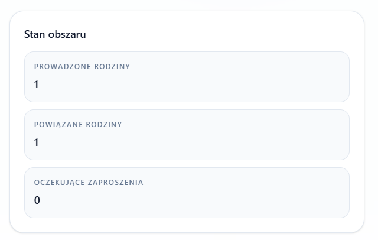

# Implementation Plan

- Task ID: `2026-04-27-vercel-log-scripts`
- Status: `COMPLETED`

## Branch And PR Creation Strategy

- Current slice status:
  - implementation complete
  - focused validation complete
  - repo-wide lint/typecheck green
  - ready for PR preparation

- Current Git reality:
  - `feat/authjs-pr2` currently shares the same commit base as `main`
  - the split work lives in the working tree, not in a stack of already-separated commits
- Recommended strategy:
  - create a new branch for each PR from the current `HEAD` after confirming it still matches `main`
  - in practice today that means: create each PR branch from `main` or from the current branch tip; both resolve to the same base commit right now
  - do **not** target later PRs at `feat/authjs-pr2`
  - do **not** create stacked PRs by default for this split
- PR target branch:
  - target `main` for PR 1
  - target `main` for PR 2
  - target `main` for PR 3
  - target `main` for PR 4
- Why this is the default:
  - each PR should be independently reviewable and independently green in CI
  - targeting `main` keeps each diff honest and avoids hidden dependency on an unmerged intermediate PR
  - the file lists below were made intentionally disjoint so each PR can stand on its own
- Safety rule before creating each PR branch:
  - re-check that `git merge-base main HEAD` still equals `git rev-parse main`
  - if that stops being true because you start committing PR 1 first, re-evaluate whether the next PR should still branch from `main` or be rebuilt from a fresh clean checkout
- Working method:
  - start from a clean checkout at `main`
  - create one new branch per PR
  - use only the `git add` lines listed under that PR
  - commit and open that PR against `main`
  - return to a clean base before assembling the next PR

## Current PR Scope

### PR 1: Vercel CLI Wrapper And CI-Green Baseline

- Branch creation:
  - create a fresh branch from `main` for this PR
- PR base branch:
  - `main`

- Scope:
  - `scripts/vercel/cli.ts`
  - `scripts/vercel/cli.test.ts`
  - `package.json`
  - small CI-unblocking fixes required for green validation:
    - `scripts/reconcile-known-migration-state.ts`
    - `scripts/reconcile-known-migration-state.test.ts`
- Acceptance:
  - local Vercel helper commands run successfully
  - focused unit tests pass
  - repo-wide `pnpm lint --fix` passes
  - repo-wide `pnpm typecheck` passes
- Notes:
  - keep this PR narrow and tooling-oriented
  - do not mix unrelated product features into this PR body
- `git add` commands:

```shell
git add package.json
git add scripts/reconcile-known-migration-state.test.ts
git add scripts/reconcile-known-migration-state.ts
git add scripts/vercel/cli.test.ts
git add scripts/vercel/cli.ts
```

## Next PR Candidates

### PR 2: AuthJS Routing And Onboarding Stabilization

- Branch creation:
  - create a fresh branch from `main` for this PR
  - do not base it on PR 1 unless the file list below is changed and an explicit dependency is introduced
- PR base branch:
  - `main`

- Candidate scope:
  - `src/app/auth/bootstrap/**`
  - `src/app/auth/post-auth-redirect.ts`
  - `src/app/auth/post-auth-redirect.test.ts`
  - `src/app/auth/signin/**`
  - `src/app/api/auth/[...nextauth]/**`
  - `src/app/api/auth/active-org/**`
  - `src/app/api/internal/e2e/**`
  - `src/app/onboarding/**`
  - `src/app/users/**`
  - `src/app/dashboard/**`
  - `src/modules/auth/**`
  - `src/security/middleware/**`
  - `src/shared/lib/routing/auth-entry.ts`
  - `e2e/authjs-*.spec.ts`
  - `e2e/authjs-auth.ts`
- Goal:
  - isolate auth-flow settlement, onboarding redirects, and AuthJS session behavior
- CI strategy:
  - require focused auth validation first, then repo-wide gates
  - prefer `pnpm e2e:authjs:core` before broader suites
- Notes:
  - keep the changed AuthJS route handlers, the internal E2E provisioning route, and the auth E2E helper in the same PR as the browser specs
  - keep the auth entry helper and dashboard landing files in this PR because redirects now settle there
  - keep `src/security/core/node-provisioning-runtime.ts` in this PR because bootstrap, dashboard, and users layouts depend on the single-tenant organization probe fix
  - keep focused auth integration coverage in this PR via `src/testing/integration/middleware.test.ts`, `src/testing/integration/proxy-runtime.integration.test.ts`, and `src/testing/infrastructure/env.ts`
  - keep `src/core/env.ts` in this PR because `src/app/dashboard/tools-inventory.ts` and `src/testing/infrastructure/env.ts` now depend on `EMAIL_PROVIDER` typing
  - keep `src/modules/provisioning/infrastructure/SingleTenantResolver.ts` in this PR because `src/modules/auth/index.ts` now constructs it with an organization-resolution callback
  - keep `src/shared/components/ui/avatar.tsx` in this PR because `src/modules/auth/ui/authjs/UserAvatarMenu.tsx` imports it directly
  - keep `src/modules/user/infrastructure/drizzle/schema.ts` in this PR because `src/app/api/internal/e2e/authjs-user/route.ts` now writes `deactivatedAt`
  - keep the generated Drizzle migration artifacts for `users.deactivated_at` in this PR because CI DB tests fail on a fresh schema without them; the exact reproduced failure was `column "deactivated_at" of relation "users" does not exist`
  - include only the additive migration artifacts for that fix in PR 2; do not include the unrelated deletion of `src/core/db/migrations/generated/0014_pending_invitation_unique.sql` as part of this repair
  - leave signup, invite, waitlist, verification, forgot-password, and reset-password files to PR 4 so the registration/email boundary stays whole
  - do not include `e2e/authjs-verify-email.spec.ts` in PR 2; it belongs with the verification pages in PR 4
  - this means PR 2 now intentionally overlaps with later slices on a few compatibility files; after PR 2 merges, rebuild PR 3 and PR 4 from updated `main` instead of reusing an older staging list blindly
- `git add` commands:

```shell
git add e2e/authjs-auth.ts
git add e2e/authjs-dashboard-entry.spec.ts
git add e2e/authjs-onboarding-entry.spec.ts
git add e2e/authjs-session.spec.ts
git add src/app/api/auth/[...nextauth]/route.ts
git add src/app/api/auth/active-org/route.test.ts
git add src/app/api/auth/active-org/route.ts
git add src/app/api/internal/e2e/authjs-user/route.ts
git add src/app/auth/bootstrap/bootstrap-error.test.tsx
git add src/app/auth/bootstrap/bootstrap-error.tsx
git add src/app/auth/bootstrap/page.tsx
git add src/app/auth/bootstrap/start/route.test.ts
git add src/app/auth/bootstrap/start/route.ts
git add src/app/auth/post-auth-redirect.test.ts
git add src/app/auth/post-auth-redirect.ts
git add src/app/auth/signin/page.tsx
git add src/app/auth/signin/sign-in-client.test.tsx
git add src/app/auth/signin/sign-in-client.tsx
git add src/app/dashboard/DashboardToolsTable.test.tsx
git add src/app/dashboard/DashboardToolsTable.tsx
git add src/app/dashboard/layout.test.tsx
git add src/app/dashboard/layout.tsx
git add src/app/dashboard/page.tsx
git add src/app/dashboard/tools-inventory.ts
git add src/app/onboarding/actions.test.ts
git add src/app/onboarding/actions.ts
git add src/app/onboarding/layout.test.tsx
git add src/app/onboarding/layout.tsx
git add src/app/users/layout.test.tsx
git add src/app/users/layout.tsx
git add src/core/env.ts
git add src/core/db/migrations/generated/0012_users_deactivated_at.sql
git add src/core/db/migrations/generated/0013_reconcile_snapshot.sql
git add src/core/db/migrations/generated/meta/0013_snapshot.json
git add src/core/db/migrations/generated/meta/_journal.json
git add src/modules/auth/index.ts
git add src/modules/auth/infrastructure/authjs/AuthJsRequestIdentitySource.ts
git add src/modules/auth/infrastructure/authjs/auth.test.ts
git add src/modules/auth/infrastructure/authjs/auth.ts
git add src/modules/auth/infrastructure/drizzle/DrizzleInternalIdentityLookup.test.ts
git add src/modules/auth/ui/HeaderAuthControls.tsx
git add src/modules/auth/ui/authjs/AuthJsWorkspaceSwitcher.test.tsx
git add src/modules/auth/ui/authjs/AuthJsWorkspaceSwitcher.tsx
git add src/modules/auth/ui/authjs/HeaderAuthControlsAuthjs.test.tsx
git add src/modules/auth/ui/authjs/HeaderAuthControlsAuthjs.tsx
git add src/modules/auth/ui/authjs/UserAvatarMenu.tsx
git add src/modules/provisioning/infrastructure/SingleTenantResolver.ts
git add src/modules/user/infrastructure/drizzle/schema.ts
git add src/security/middleware/route-policy.ts
git add src/security/middleware/with-auth.test.ts
git add src/security/middleware/with-auth.ts
git add src/security/middleware/with-registration-mode.ts
git add src/security/core/node-provisioning-runtime.ts
git add src/shared/components/ui/avatar.tsx
git add src/shared/lib/routing/auth-entry.ts
git add src/testing/infrastructure/env.ts
git add src/testing/integration/middleware.test.ts
git add src/testing/integration/proxy-runtime.integration.test.ts
```

### PR 3: Admin Invitations And User Management

- Branch creation:
  - create a fresh branch from `main` for this PR
  - do not base it on PR 2; this plan assumes the admin feature remains independently reviewable
- PR base branch:
  - `main`

- Candidate scope:
  - `src/app/admin/**`
  - `src/app/api/admin/**`
  - `src/modules/authorization/infrastructure/**`
  - `src/modules/invitations/**`
  - `src/modules/user/**`
  - `src/security/core/platform-admin.ts`
  - `e2e/admin*.spec.ts`
- Goal:
  - isolate admin UI, invitation flows, and user management behavior from auth-platform work
- CI strategy:
  - require focused tests for invitations/admin flows plus repo-wide gates
- Notes:
  - keep admin API routes in the same PR as the authorization schema and platform-admin helper they now depend on
- `git add` commands:

```shell
git add e2e/admin-users.spec.ts
git add e2e/admin.spec.ts
git add src/app/admin/invitations/InvitationsClient.test.tsx
git add src/app/admin/invitations/InvitationsClient.tsx
git add src/app/admin/invitations/page.tsx
git add src/app/admin/layout.test.tsx
git add src/app/admin/layout.tsx
git add src/app/admin/page.tsx
git add src/app/admin/users/UsersClient.tsx
git add src/app/admin/users/page.tsx
git add src/app/admin/waitlist/WaitlistActions.tsx
git add src/app/admin/waitlist/page.tsx
git add src/app/api/admin/invitations/[id]/route.test.ts
git add src/app/api/admin/invitations/[id]/route.ts
git add src/app/api/admin/invitations/route.test.ts
git add src/app/api/admin/invitations/route.ts
git add src/app/api/admin/users/[id]/route.test.ts
git add src/app/api/admin/users/[id]/route.ts
git add src/app/api/admin/users/route.test.ts
git add src/app/api/admin/users/route.ts
git add src/app/api/admin/waitlist/[id]/route.ts
git add src/app/api/admin/waitlist/route.ts
git add src/modules/authorization/infrastructure/drizzle/schema.ts
git add src/modules/authorization/infrastructure/drizzle/seed.ts
git add src/modules/invitations/domain/EmailService.ts
git add src/modules/invitations/domain/InvitationRepository.ts
git add src/modules/invitations/infrastructure/DefaultInvitationService.test.ts
git add src/modules/invitations/infrastructure/DefaultInvitationService.ts
git add src/modules/invitations/infrastructure/DrizzleInvitationRepository.test.ts
git add src/modules/invitations/infrastructure/EmailServiceFactory.test.ts
git add src/modules/invitations/infrastructure/EmailServiceFactory.ts
git add src/modules/invitations/infrastructure/NoOpEmailService.ts
git add src/modules/invitations/infrastructure/clerk/ClerkInvitationBridge.ts
git add src/modules/invitations/infrastructure/drizzle/DrizzleInvitationRepository.ts
git add src/modules/invitations/infrastructure/resend/ResendEmailService.test.ts
git add src/modules/invitations/infrastructure/resend/ResendEmailService.ts
git add src/modules/invitations/infrastructure/smtp/NodemailerEmailService.test.ts
git add src/modules/invitations/infrastructure/smtp/NodemailerEmailService.ts
git add src/modules/invitations/ui/InviteMemberForm.test.tsx
git add src/modules/invitations/ui/InviteMemberForm.tsx
git add src/modules/user/infrastructure/drizzle/DrizzleUserRepository.db.test.ts
git add src/modules/user/infrastructure/drizzle/DrizzleUserRepository.ts
git add src/modules/user/infrastructure/drizzle/schema.ts
git add src/security/core/platform-admin.ts
```

### PR 4: Email Adapters, Waitlist, And Bootstrap Support

- Branch creation:
  - create a fresh branch from `main` for this PR
  - do not target PR 2 or PR 3; keep this PR standalone against `main`
- PR base branch:
  - `main`

- Candidate scope:
  - `src/modules/waitlist/**`
  - `src/modules/invitations/infrastructure/{resend,smtp,clerk}/**`
  - `src/modules/invitations/infrastructure/EmailServiceFactory.ts`
  - `src/modules/invitations/infrastructure/EmailServiceFactory.test.ts`
  - `src/modules/invitations/infrastructure/NoOpEmailService.ts`
  - `e2e/authjs-verify-email.spec.ts`
  - `src/modules/invitations/domain/EmailService.ts`
  - `src/app/auth/forgot-password/**`
  - `src/app/auth/invite/**`
  - `src/app/auth/registration-closed/**`
  - `src/app/auth/reset-password/**`
  - `src/app/auth/signup/**`
  - `src/app/auth/verify-email/**`
  - `src/app/auth/verify-email-pending/**`
  - `src/app/waitlist/**`
  - `src/app/api/auth/waitlist/**`
  - `src/app/api/auth/invite/**`
  - `src/app/api/auth/signup/**`
  - `src/app/api/auth/resend-verification/**`
  - `src/app/api/auth/forgot-password/**`
  - `src/app/api/auth/reset-password/**`
  - `scripts/bootstrap-admin.ts`
  - `src/shared/lib/security/email-safety.ts`
  - related docs if still needed after code split
- Goal:
  - isolate adapter/provider and bootstrap changes from auth-routing and admin UI work
- CI strategy:
  - focused unit/integration validation for adapters, then repo-wide gates
- Notes:
  - keep the public waitlist route and registration/email auth edges with the adapter changes so the feature boundary stays whole
  - this PR intentionally owns the auth-facing invite/signup/verify/reset surfaces so it stays disjoint from PR 2
- `git add` commands:

```shell
git add scripts/bootstrap-admin.ts
git add src/app/api/auth/forgot-password/route.ts
git add src/app/api/auth/invite/[token]/route.ts
git add src/app/api/auth/invite/route.ts
git add src/app/api/auth/resend-verification/route.test.ts
git add src/app/api/auth/resend-verification/route.ts
git add src/app/api/auth/reset-password/route.ts
git add src/app/api/auth/signup/route.test.ts
git add src/app/api/auth/signup/route.ts
git add src/app/api/auth/waitlist/route.ts
git add src/app/auth/forgot-password/forgot-password-client.tsx
git add src/app/auth/invite/[token]/InviteAcceptButton.test.tsx
git add src/app/auth/invite/[token]/InviteAcceptButton.tsx
git add src/app/auth/invite/[token]/InviteSignOutButton.tsx
git add src/app/auth/invite/[token]/invite-links.test.ts
git add src/app/auth/invite/[token]/invite-links.ts
git add src/app/auth/invite/[token]/page.tsx
git add src/app/auth/registration-closed/page.tsx
git add src/app/auth/reset-password/page.tsx
git add src/app/auth/reset-password/reset-password-client.tsx
git add src/app/auth/signup/page.test.tsx
git add src/app/auth/signup/page.tsx
git add src/app/auth/signup/sign-up-client.test.tsx
git add src/app/auth/signup/sign-up-client.tsx
git add src/app/auth/verify-email-pending/page.tsx
git add src/app/auth/verify-email-pending/verify-email-pending-client.tsx
git add src/app/auth/verify-email/page.tsx
git add src/app/waitlist/page.tsx
git add src/modules/invitations/domain/EmailService.ts
git add src/modules/invitations/infrastructure/EmailServiceFactory.test.ts
git add src/modules/invitations/infrastructure/EmailServiceFactory.ts
git add src/modules/invitations/infrastructure/NoOpEmailService.ts
git add src/modules/waitlist/infrastructure/clerk/ClerkWaitlistBridge.ts
git add src/modules/waitlist/ui/WaitlistJoinForm.tsx
git add src/shared/lib/security/email-safety.ts
```

## Split Rules

- Keep `.copilot/tasks/**`, `.zencoder/**`, and broad AI-instruction churn out of product PRs unless the PR is specifically about agent infrastructure.
- Treat repo-wide green `pnpm lint --fix` and `pnpm typecheck` as mandatory before each PR is cut.
- Prefer one behavior cluster per PR so failures are attributable and CI rollback is cheap.
