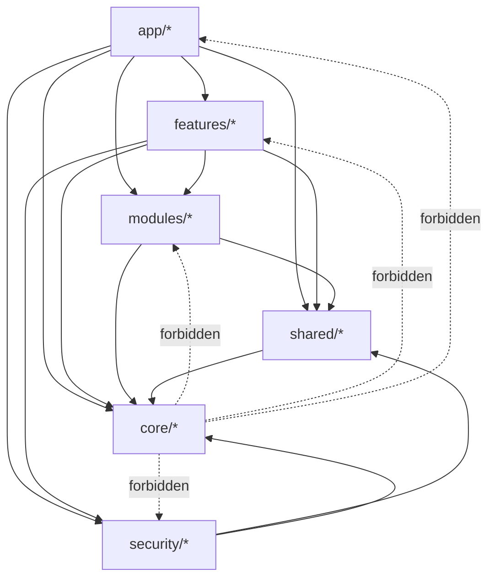

# 01 - Global Dependency Rules

```mermaid
flowchart TD
APP["app/*"]
FEATURES["features/*"]
MODULES["modules/*"]
SECURITY["security/*"]
SHARED["shared/*"]
CORE["core/*"]

APP --> FEATURES
APP --> MODULES
APP --> SECURITY
APP --> SHARED
APP --> CORE

FEATURES --> MODULES
FEATURES --> SECURITY
FEATURES --> SHARED
FEATURES --> CORE

MODULES --> SHARED
MODULES --> CORE

SECURITY --> SHARED
SECURITY --> CORE

SHARED --> CORE

CORE -. forbidden .-> MODULES
CORE -. forbidden .-> SECURITY
CORE -. forbidden .-> FEATURES
CORE -. forbidden .-> APP
```
