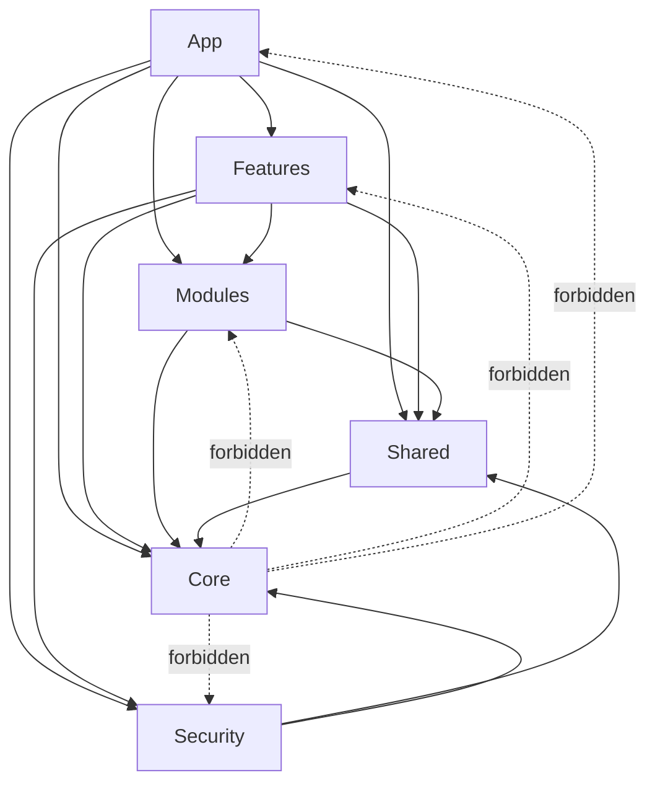

# 01 - Global Dependency Rules

```mermaid
flowchart TD
App["App"]
Features["Features"]
Modules["Modules"]
Security["Security"]
Shared["Shared"]
Core["Core"]

App --> Features
App --> Modules
App --> Security
App --> Shared
App --> Core

Features --> Modules
Features --> Security
Features --> Shared
Features --> Core

Modules --> Shared
Modules --> Core

Security --> Shared
Security --> Core

Shared --> Core

Core -. forbidden .-> Modules
Core -. forbidden .-> Security
Core -. forbidden .-> Features
Core -. forbidden .-> App
```
