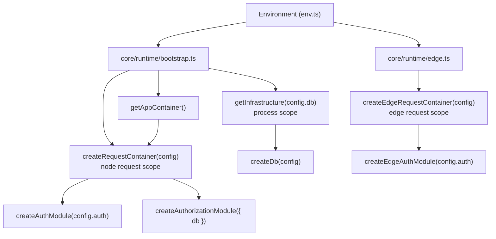

# 02 – Composition Root Architecture

```mermaid
flowchart TD

ENV["Environment (env.ts)"]

BOOTSTRAP["core/runtime/bootstrap.ts"]
INFRA["getInfrastructure(config.db)\nprocess scope"]
NODE["createRequestContainer(config)\nnode request scope"]
APP["getAppContainer()"]

EDGEBOOT["core/runtime/edge.ts"]
EDGE["createEdgeRequestContainer(config)\nedge request scope"]

DB["createDb(config)"]
AUTHMOD["createAuthModule(config.auth)"]
AUTHZMOD["createAuthorizationModule({ db })"]
EDGEAUTH["createEdgeAuthModule(config.auth)"]

ENV --> BOOTSTRAP
ENV --> EDGEBOOT

BOOTSTRAP --> INFRA
BOOTSTRAP --> NODE
BOOTSTRAP --> APP

EDGEBOOT --> EDGE

INFRA --> DB
NODE --> AUTHMOD
NODE --> AUTHZMOD

EDGE --> EDGEAUTH

APP --> NODE
```
