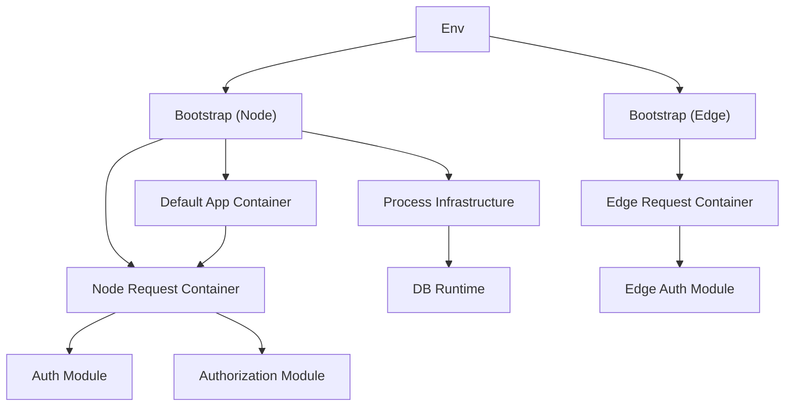

# 02 – Composition Root Architecture

```mermaid
flowchart TD

Env["Env"]

Boot["Bootstrap (Node)"]
Infra["Process Infrastructure"]
NodeC["Node Request Container"]
AppC["Default App Container"]

EdgeBoot["Bootstrap (Edge)"]
EdgeC["Edge Request Container"]

Db["DB Runtime"]
AuthMod["Auth Module"]
AuthzMod["Authorization Module"]
EdgeAuth["Edge Auth Module"]

Env --> Boot
Env --> EdgeBoot

Boot --> Infra --> Db
Boot --> NodeC
Boot --> AppC

EdgeBoot --> EdgeC

NodeC --> AuthMod
NodeC --> AuthzMod

EdgeC --> EdgeAuth

AppC --> NodeC
```
