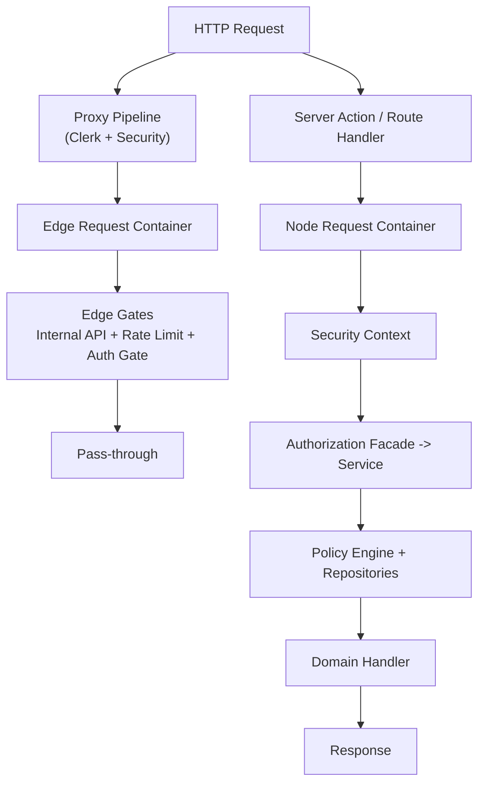

# 03 – Request Lifecycle

```mermaid
flowchart TD

Req["HTTP Request"]
Proxy["Proxy Pipeline\n(Clerk + Security)"]

EdgeC["Edge Request Container"]
EdgeGates["Edge Gates\nInternal API + Rate Limit + Auth Gate"]
Pass["Pass-through"]

NodeEntry["Server Action / Route Handler"]
NodeC["Node Request Container"]

Ctx["Security Context"]
Authz["Authorization Facade -> Service"]
Policy["Policy Engine + Repositories"]
Domain["Domain Handler"]
Res["Response"]

Req --> Proxy --> EdgeC --> EdgeGates --> Pass

Req --> NodeEntry --> NodeC --> Ctx

Ctx --> Authz --> Policy --> Domain --> Res
```
