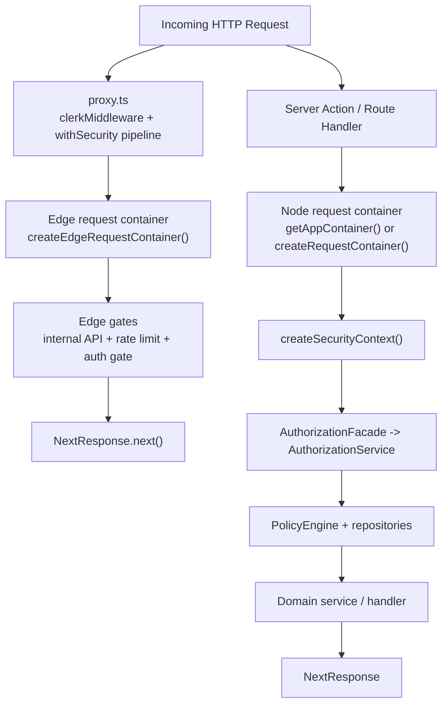

# 03 – Request Lifecycle

```mermaid
flowchart TD

REQ["Incoming HTTP Request"]
PROXY["proxy.ts\nclerkMiddleware + withSecurity pipeline"]

EDGEC["Edge request container\ncreateEdgeRequestContainer()"]
EDGESEC["Edge gates\ninternal API + rate limit + auth gate"]
NEXT["NextResponse.next()"]

NODEENTRY["Server Action / Route Handler"]
NODEC["Node request container\ngetAppContainer() or createRequestContainer()"]

CTX["createSecurityContext()"]
AUTHZ["AuthorizationFacade -> AuthorizationService"]
POLICY["PolicyEngine + repositories"]
DOMAIN["Domain service / handler"]
RESPONSE["NextResponse"]

REQ --> PROXY
PROXY --> EDGEC
EDGEC --> EDGESEC
EDGESEC --> NEXT

REQ --> NODEENTRY
NODEENTRY --> NODEC
NODEC --> CTX

CTX --> AUTHZ
AUTHZ --> POLICY
POLICY --> DOMAIN
DOMAIN --> RESPONSE
```
