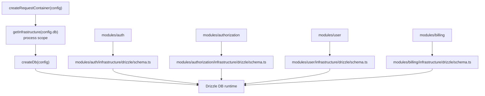

# 04 – DB Ownership

```mermaid
flowchart TD

BOOT["createRequestContainer(config)"]
INFRA["getInfrastructure(config.db)\nprocess scope"]
CREATEDB["createDb(config)"]
DB["Drizzle DB runtime"]

AUTHMOD["modules/auth"]
AUTHZMOD["modules/authorization"]
USERMOD["modules/user"]
BILLINGMOD["modules/billing"]

SCHEMA_AUTH["modules/auth/infrastructure/drizzle/schema.ts"]
SCHEMA_AUTHZ["modules/authorization/infrastructure/drizzle/schema.ts"]
SCHEMA_USER["modules/user/infrastructure/drizzle/schema.ts"]
SCHEMA_BILLING["modules/billing/infrastructure/drizzle/schema.ts"]

BOOT --> INFRA
INFRA --> CREATEDB
CREATEDB --> DB

AUTHMOD --> SCHEMA_AUTH
AUTHZMOD --> SCHEMA_AUTHZ
USERMOD --> SCHEMA_USER
BILLINGMOD --> SCHEMA_BILLING

SCHEMA_AUTH --> DB
SCHEMA_AUTHZ --> DB
SCHEMA_USER --> DB
SCHEMA_BILLING --> DB
```
