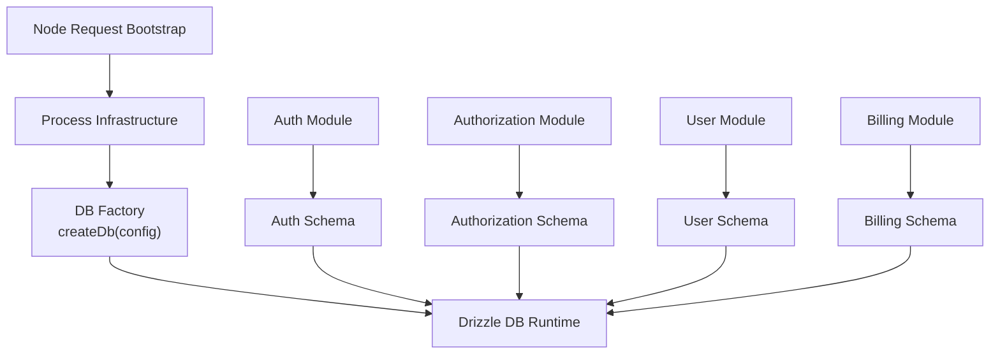

# 04 – DB Ownership

```mermaid
flowchart TD

Boot["Node Request Bootstrap"]
Infra["Process Infrastructure"]
DbFactory["DB Factory\ncreateDb(config)"]
Db["Drizzle DB Runtime"]

AuthMod["Auth Module"]
AuthzMod["Authorization Module"]
UserMod["User Module"]
BillingMod["Billing Module"]

SchemaAuth["Auth Schema"]
SchemaAuthz["Authorization Schema"]
SchemaUser["User Schema"]
SchemaBilling["Billing Schema"]

Boot --> Infra --> DbFactory --> Db

AuthMod --> SchemaAuth
AuthzMod --> SchemaAuthz
UserMod --> SchemaUser
BillingMod --> SchemaBilling

SchemaAuth --> Db
SchemaAuthz --> Db
SchemaUser --> Db
SchemaBilling --> Db
```
