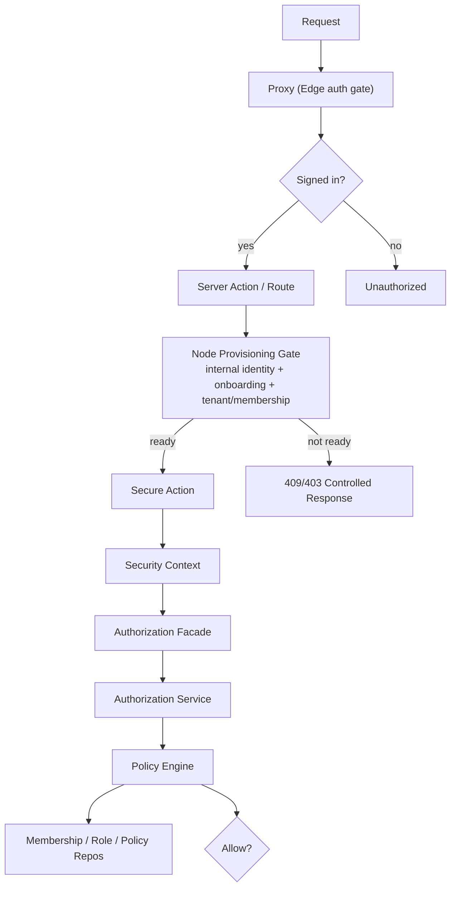

# 05 – Authorization Flow

```mermaid
flowchart TD

Req["Request"]
Proxy["Proxy (Edge auth gate)"]
EdgeGate{"Signed in?"}

NodeEntry["Server Action / Route"]
NodeProv["Node Provisioning Gate\ninternal identity + onboarding + tenant/membership"]
Secure["Secure Action"]
Ctx["Security Context"]

Facade["Authorization Facade"]
Service["Authorization Service"]
Engine["Policy Engine"]
Repos["Membership / Role / Policy Repos"]

Allow{"Allow?"}

Req --> Proxy --> EdgeGate
EdgeGate -->|yes| NodeEntry
EdgeGate -->|no| Deny["Unauthorized"]

NodeEntry --> NodeProv
NodeProv -->|ready| Secure --> Ctx
NodeProv -->|not ready| DenyProv["409/403 Controlled Response"]

Ctx --> Facade --> Service --> Engine --> Repos

Engine --> Allow
```
