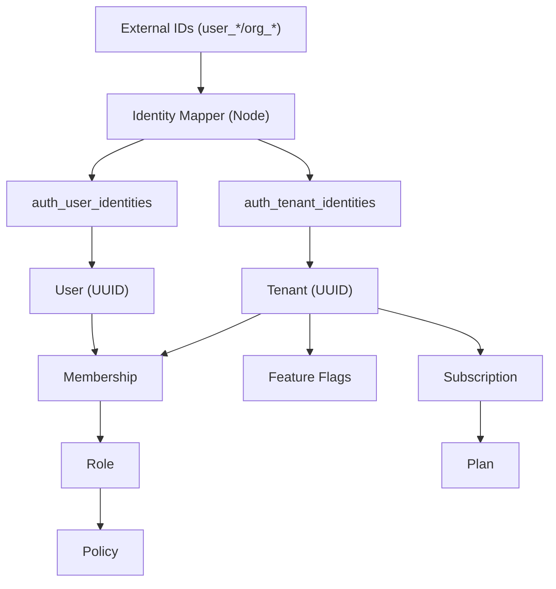

# 06 – Multi-Tenant SaaS Expansion Map

```mermaid
flowchart TD

Ext["External IDs (user_*/org_*)"]
Map["Identity Mapper (Node)"]
UMap["auth_user_identities"]
TMap["auth_tenant_identities"]

User["User (UUID)"]
Tenant["Tenant (UUID)"]
Membership["Membership"]
Role["Role"]
Policy["Policy"]
Flags["Feature Flags"]
Sub["Subscription"]
Plan["Plan"]

Ext --> Map
Map --> UMap --> User
Map --> TMap --> Tenant

User --> Membership
Tenant --> Membership --> Role --> Policy
Tenant --> Flags
Tenant --> Sub --> Plan
```
