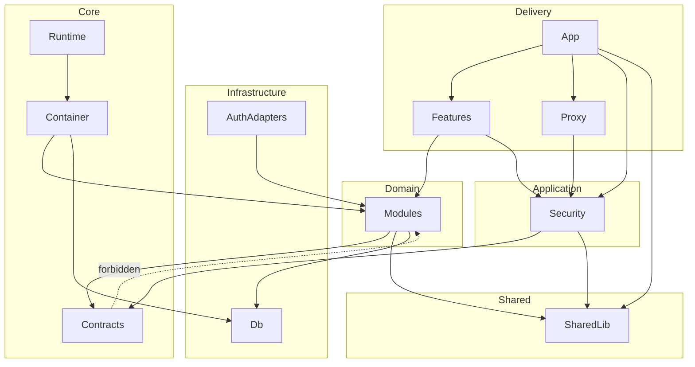

# 07 – Enterprise Clean Dependency Graph

```mermaid
flowchart TD

subgraph Delivery
	App
	Features
	Proxy
end

subgraph Application
	Security
end

subgraph Domain
	Modules
end

subgraph Infrastructure
	Db
	AuthAdapters
end

subgraph Core
	Container
	Contracts
	Runtime
end

subgraph Shared
	SharedLib
end

App --> Features
App --> Proxy
App --> Security
App --> SharedLib
Features --> Modules
Features --> Security

Proxy --> Security
Security --> Contracts
Security --> SharedLib

Modules --> Contracts
Modules --> SharedLib
Modules --> Db

Runtime --> Container
Container --> Modules
Container --> Db
AuthAdapters --> Modules

Contracts -. forbidden .-> Modules
```
