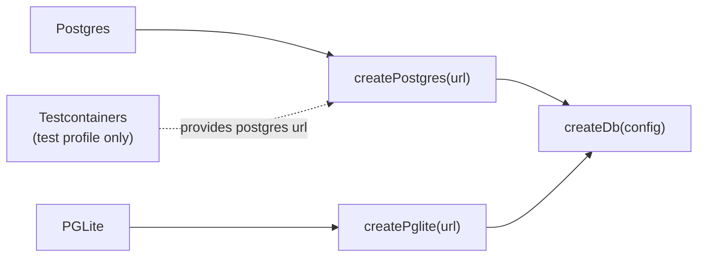

# 08 – Infrastructure Layer Separation

```mermaid
flowchart LR

POSTGRES["Postgres"]
PGLITE["PGLite"]
TESTCONTAINERS["Testcontainers\n(test profile only)"]

CREATEDB["createDb(config)"]
POSTGRESDRV["createPostgres(url)"]
PGLITEDRV["createPglite(url)"]

POSTGRES --> POSTGRESDRV
PGLITE --> PGLITEDRV
POSTGRESDRV --> CREATEDB
PGLITEDRV --> CREATEDB

TESTCONTAINERS -. provides postgres url .-> POSTGRESDRV
```
