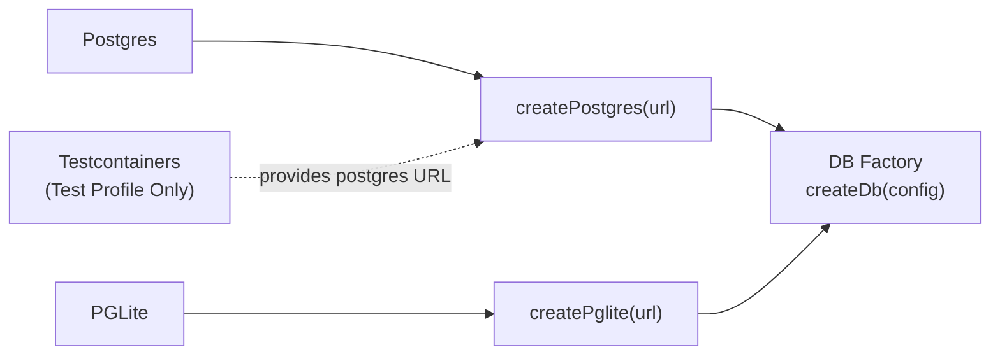

# 08 – Infrastructure Layer Separation

```mermaid
flowchart LR

Postgres["Postgres"]
Pglite["PGLite"]
Testcontainers["Testcontainers\n(Test Profile Only)"]

DbFactory["DB Factory\ncreateDb(config)"]
PostgresDriver["createPostgres(url)"]
PgliteDriver["createPglite(url)"]

Postgres --> PostgresDriver
Pglite --> PgliteDriver
PostgresDriver --> DbFactory
PgliteDriver --> DbFactory

Testcontainers -. provides postgres URL .-> PostgresDriver
```
