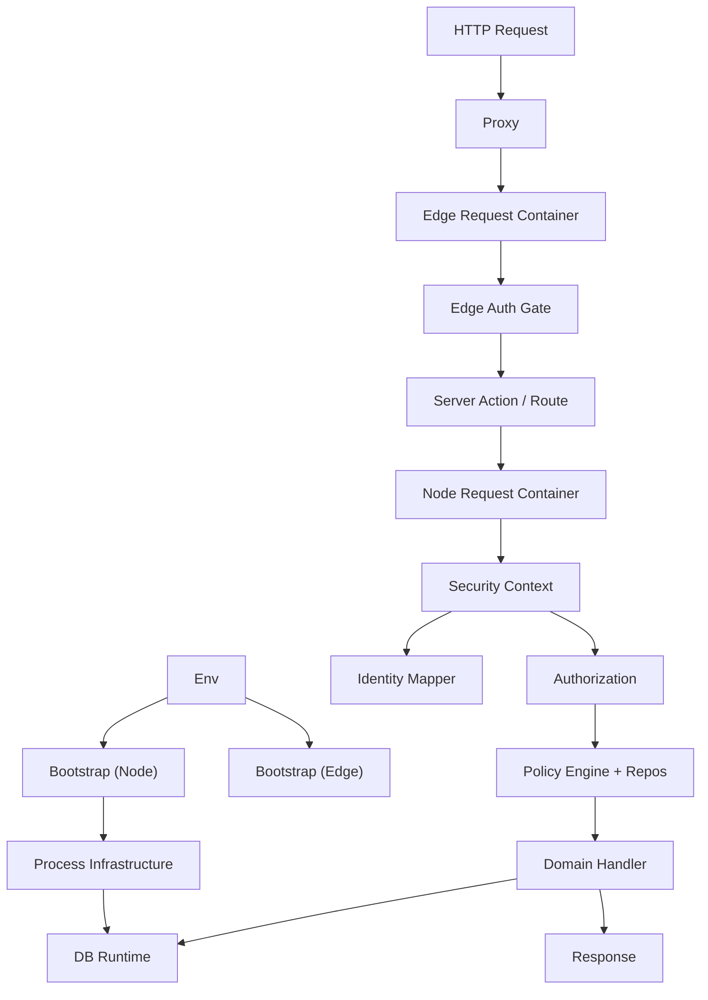

# 09 – Final Enterprise Flow (FULL PICTURE)

```mermaid
flowchart TD

Env["Env"]
Boot["Bootstrap (Node)"]
EdgeBoot["Bootstrap (Edge)"]
Infra["Process Infrastructure"]
Db["DB Runtime"]

Req["HTTP Request"]
Proxy["Proxy"]
EdgeC["Edge Request Container"]
EdgeGate["Edge Auth Gate"]

NodeEntry["Server Action / Route"]
NodeC["Node Request Container"]
Ctx["Security Context"]
Mapper["Identity Mapper"]
Authz["Authorization"]
Policy["Policy Engine + Repos"]
Domain["Domain Handler"]
Res["Response"]

Env --> Boot --> Infra --> Db
Env --> EdgeBoot

Req --> Proxy --> EdgeC --> EdgeGate --> NodeEntry

NodeEntry --> NodeC --> Ctx
Ctx --> Mapper
Ctx --> Authz --> Policy --> Domain
Domain --> Db
Domain --> Res
```
