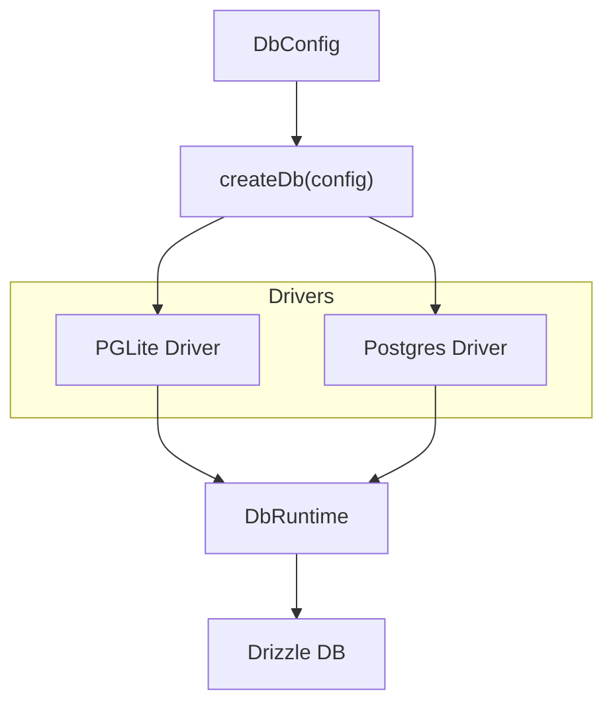

# 01 - Final DB Architecture - High Level

```mermaid
flowchart TD
  Config["DbConfig"]
  Create["createDb(config)"]

  subgraph Drivers
    Pglite["PGLite Driver"]
    Postgres["Postgres Driver"]
  end

  Runtime["DbRuntime"]
  Drizzle["Drizzle DB"]

  Config --> Create
  Create --> Pglite
  Create --> Postgres

  Pglite --> Runtime
  Postgres --> Runtime
  Runtime --> Drizzle
```
