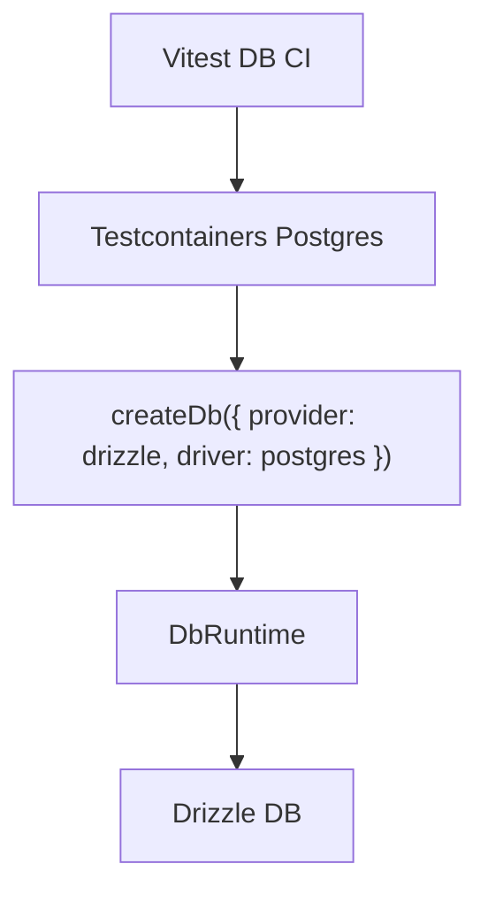

# 08 - Testcontainers Real Postgres (CI) - Diagram

```mermaid
flowchart TD
  Test["Vitest DB CI"]
  Container["Testcontainers Postgres"]
  Create["createDb({ provider: drizzle, driver: postgres })"]
  Runtime["DbRuntime"]
  Db["Drizzle DB"]

  Test --> Container
  Container --> Create
  Create --> Runtime
  Runtime --> Db
```
