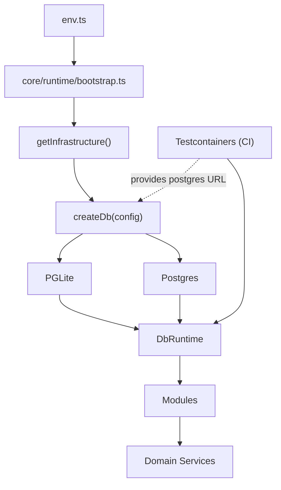

# 11 - Final Enterprise DB Flow

```mermaid
flowchart TD
  Env["env.ts"]
  Boot["core/runtime/bootstrap.ts"]
  Infra["getInfrastructure()"]
  CreateDb["createDb(config)"]

  Pglite["PGLite"]
  Postgres["Postgres"]
  Testcontainers["Testcontainers (CI)"]

  Runtime["DbRuntime"]
  Modules["Modules"]
  Domain["Domain Services"]

  Env --> Boot --> Infra --> CreateDb

  CreateDb --> Pglite
  CreateDb --> Postgres
  Testcontainers -. provides postgres URL .-> CreateDb

  Pglite --> Runtime
  Postgres --> Runtime
  Testcontainers --> Runtime

  Runtime --> Modules --> Domain
```
