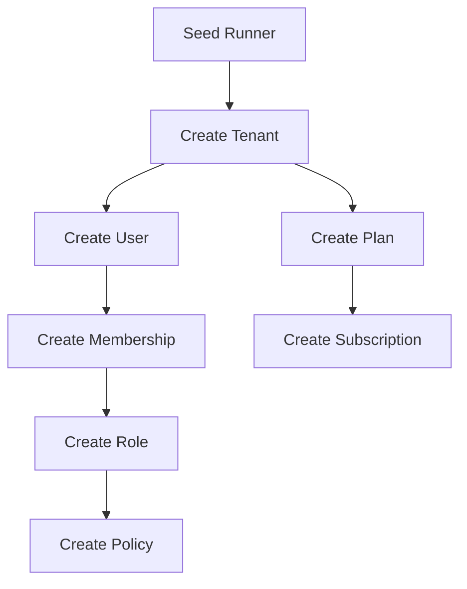

# 15 - Seed Architecture Diagram

```mermaid
flowchart TD
  Seed["Seed Runner"]
  Tenant["Create Tenant"]
  User["Create User"]
  Membership["Create Membership"]
  Role["Create Role"]
  Policy["Create Policy"]
  Plan["Create Plan"]
  Subscription["Create Subscription"]

  Seed --> Tenant
  Tenant --> User
  User --> Membership
  Membership --> Role
  Role --> Policy
  Tenant --> Plan
  Plan --> Subscription
```
