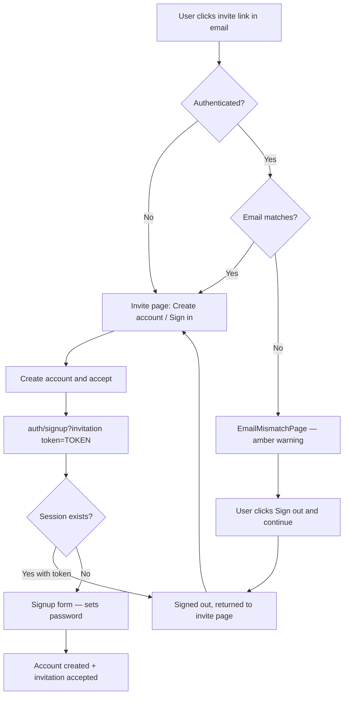

# 33 — Waitlist Email Flow

## Overview

This document describes the complete email notification lifecycle for the **AuthJS waitlist flow** — from a user joining the waitlist through admin approval or rejection, including implementation details, environment configuration, and the decision rationale for each step.

The waitlist email flow is only active when `REGISTRATION_MODE=invite-only` and `AUTH_PROVIDER=authjs`.

For Clerk-managed waitlists, see `docs/features/16 - Clerk Waitlist.md`.

---

## Flow Diagram

```
User                      System                      Admin
 |                           |                           |
 |-- POST /api/auth/waitlist→|                           |
 |                           |-- Insert pending entry    |
 |                           |-- sendWaitlistConfirmationEmail()
 |←-- "You're on the list!" |                           |
 |                           |                           |
 |                           |←-- POST /api/admin/waitlist/[id]?action=approve
 |                           |-- Mark approved in DB     |
 |                           |-- Resolve org + role (auto or env)
 |                           |-- Create invitation (72h token)
 |                           |-- sendInvitationEmail()   |
 |←-- "Your application was approved — create account"  |
 |-- GET /auth/invite/[token]|                           |
 |-- Sets password, provisioned as member               |
 |                           |                           |
 |                           |←-- POST /api/admin/waitlist/[id]?action=reject
 |                           |-- Mark rejected in DB     |
 |                           |-- sendWaitlistRejectionEmail() (default: on)
 |←-- "Update on your application"                      |
```

---

## Event 1 — User Joins Waitlist

**Endpoint**: `POST /api/auth/waitlist`

**Implementation**: `DefaultWaitlistService.joinWaitlist()`

### What Happens

1. Duplicate email check — if already on waitlist, returns `DuplicateWaitlistEntryError` (409)
2. Entry inserted into `waitlistEntries` DB table with `status = 'pending'`
3. `sendWaitlistConfirmationEmail()` called via the configured email adapter
4. Email failures are caught and logged — they do **not** fail the HTTP response (entry is still created)

### Email Content

- **Subject**: "You're on the waitlist!"
- **Body**: Acknowledges receipt, sets expectations that the team will review

### Configuration

```dotenv
EMAIL_PROVIDER=resend       # none | resend | smtp
RESEND_API_KEY=...
RESEND_FROM_EMAIL=noreply@example.com
```

With `EMAIL_PROVIDER=none` (default/dev): NoOp adapter — logs to console, no real email sent.

---

## Event 2 — Admin Approves

**Endpoint**: `POST /api/admin/waitlist/[id]?action=approve`

**Implementation**: `src/app/api/admin/waitlist/[id]/route.ts`

**Guard**: `withNodeProvisioning` — requires authenticated provisioned admin user

### What Happens

1. Entry marked `approved` in DB via `DefaultWaitlistService.approveEntry()`
2. Org ID and member role ID resolved (see **Org/Role Resolution** below)
3. `DefaultInvitationService.createInvitation()` called — creates invitation record with a secure random token (72h expiry)
4. `sendInvitationEmail()` called — sends the invite link to the user
5. User clicks `/auth/invite/[token]` → sets password → provisioned as `member`

### Org/Role Resolution (Auto-Resolve for Single Tenancy)

The invitation requires an `organizationId` and `roleId`. These are resolved in priority order:

| Priority | Source                                    | Used when                                                                                  |
| -------- | ----------------------------------------- | ------------------------------------------------------------------------------------------ |
| 1        | `entry.organizationId`                    | User joined via an org-scoped waitlist                                                     |
| 2        | `WAITLIST_INVITE_ORGANIZATION_ID` env var | Manually set override (any tenancy mode)                                                   |
| 3        | DB auto-resolve (single tenancy only)     | `TENANCY_MODE=single` — queries org by `DEFAULT_TENANT_ID`, then `member` role in that org |

**Why auto-resolve?** In `TENANCY_MODE=single`, the organization UUID is generated at first-user provisioning time. It is not known at deploy time and cannot be pre-set in env vars without querying the DB. The auto-resolve queries:

```sql
-- Step 1: find org
SELECT id FROM organizations WHERE tenant_id = $DEFAULT_TENANT_ID LIMIT 1

-- Step 2: find member role
SELECT id FROM roles WHERE organization_id = $orgId AND name = 'member' LIMIT 1
```

If neither source yields an org+role pair, the entry is still marked approved, but a `WARN` is logged and no invitation email is sent.

### Email Content

- **Subject**: "You've been invited to join [org name]"
- **Body**: Contains the invite link — `/auth/invite/[token]`

### Configuration

```dotenv
# Optional — only needed for org or personal tenancy, or to override auto-resolve
WAITLIST_INVITE_ORGANIZATION_ID=   # UUID — leave blank for TENANCY_MODE=single
WAITLIST_INVITE_ROLE_ID=           # UUID — leave blank for TENANCY_MODE=single
```

---

## Event 3 — Admin Rejects

**Endpoint**: `POST /api/admin/waitlist/[id]?action=reject`

**Implementation**: `src/app/api/admin/waitlist/[id]/route.ts`

### What Happens

1. Entry marked `rejected` in DB via `DefaultWaitlistService.rejectEntry()`
2. Rejection email sent if `WAITLIST_SEND_REJECTION_EMAIL` is not `false` (default: `true`)
3. Email failures are caught and logged — they do **not** fail the HTTP response

### Email Content

- **Subject**: "Update on your waitlist application"
- **Body**: Polite notification — does not expose reason for rejection

### Configuration

```dotenv
# Opt-out — set false to suppress rejection emails entirely
WAITLIST_SEND_REJECTION_EMAIL=    # default: true (omit or leave blank)
WAITLIST_SEND_REJECTION_EMAIL=false   # to disable
```

**Design rationale**: Rejection email defaults to `true` (opt-out) because:

- Users are waiting for a response — silence is worse UX than a polite rejection
- Allows users to try again later or use a different contact channel
- Industry norm for waitlist products (Notion, Linear, Vercel all notify on rejection)

---

## Admin UI

The admin waitlist management UI is at `/admin/waitlist`.

- Lists all pending waitlist entries
- Approve / Reject buttons per entry — calls the route handler above
- Refreshes list after action via `router.refresh()`
- Requires `SECURITY_MANAGE_POLICIES` permission (ABAC) or `ADMIN_USER_EMAILS` env bootstrap

For admin access setup, see `docs/features/32 - AuthJS Custom Auth Provider.md` → **Platform Admin Bootstrap**.

---

## Environment Variable Reference

| Variable                                | Default | Description                                  |
| --------------------------------------- | ------- | -------------------------------------------- |
| `REGISTRATION_MODE`                     | `open`  | Set `invite-only` to enable waitlist         |
| `EMAIL_PROVIDER`                        | `none`  | `none` / `resend` / `smtp`                   |
| `RESEND_API_KEY`                        | —       | Required when `EMAIL_PROVIDER=resend`        |
| `RESEND_FROM_EMAIL`                     | —       | Sender address for Resend                    |
| `SMTP_HOST`                             | —       | SMTP server host                             |
| `SMTP_PORT`                             | —       | SMTP port (e.g. `587`)                       |
| `SMTP_SECURE`                           | —       | `true` for TLS, `false` for STARTTLS         |
| `SMTP_USER`                             | —       | SMTP auth username                           |
| `SMTP_PASS`                             | —       | SMTP auth password                           |
| `SMTP_FROM_EMAIL`                       | —       | Sender address for SMTP                      |
| `WAITLIST_INVITE_ORGANIZATION_ID`       | —       | Optional org UUID override for invitation    |
| `WAITLIST_INVITE_ROLE_ID`               | —       | Optional role UUID override for invitation   |
| `WAITLIST_SEND_REJECTION_EMAIL`         | `true`  | Set `false` to disable rejection emails      |
| `AUTH_DEV_AUTO_VERIFY`                  | `false` | Dev only — skip email verification on signup |
| `AUTH_EXPOSE_VERIFICATION_TOKEN_IN_DEV` | `false` | Dev only — log verify URL to console         |

---

## Dev Mode — No Email Setup Required

For local development and CI, use:

```dotenv
EMAIL_PROVIDER=none
AUTH_DEV_AUTO_VERIFY=true
AUTH_EXPOSE_VERIFICATION_TOKEN_IN_DEV=true
AUTH_EXPOSE_RESET_TOKEN_IN_DEV=true
```

With these settings:

- Emails are printed to the server console instead of sent
- Email verification is skipped automatically after signup
- Invite and reset URLs are logged to console so you can test flows without an email provider

---

## Invite Acceptance Flow (Session-Aware)

The invite page at `/auth/invite/[token]` handles all session states:



**Key behaviors:**

- `/auth/invite/[token]` is a **public route** — accessible without authentication
- Already signed-in users with a **different email** see an explicit conflict warning
- Already signed-in users are never silently redirected away — the invitation token is preserved
- If the signup page detects an active session with an invitation token present, it redirects back to the invite page (not to home), preserving the token

## Key Implementation Files

| File                                                                       | Purpose                                                |
| -------------------------------------------------------------------------- | ------------------------------------------------------ |
| `src/modules/waitlist/infrastructure/DefaultWaitlistService.ts`            | Join, approve, reject logic                            |
| `src/modules/waitlist/infrastructure/drizzle/DrizzleWaitlistRepository.ts` | DB access for waitlist entries                         |
| `src/modules/invitations/infrastructure/DefaultInvitationService.ts`       | Invitation creation + email send                       |
| `src/modules/invitations/infrastructure/EmailServiceFactory.ts`            | Email adapter factory                                  |
| `src/app/api/auth/waitlist/route.ts`                                       | `POST /api/auth/waitlist`                              |
| `src/app/api/admin/waitlist/[id]/route.ts`                                 | `POST /api/admin/waitlist/[id]?action=approve\|reject` |
| `src/app/admin/waitlist/page.tsx`                                          | Admin UI — waitlist list                               |
| `src/app/admin/waitlist/WaitlistActions.tsx`                               | Approve/Reject client buttons                          |
| `src/app/auth/waitlist/page.tsx`                                           | User-facing join waitlist page                         |

---

## Related Documentation

- `docs/features/32 - AuthJS Custom Auth Provider.md` — full AuthJS flow, routes, registration modes
- `docs/features/16 - Clerk Waitlist.md` — Clerk-managed waitlist (separate implementation)
- `docs/features/20 - Enterprise Security Architecture.md` — ABAC, role system, platform admin
